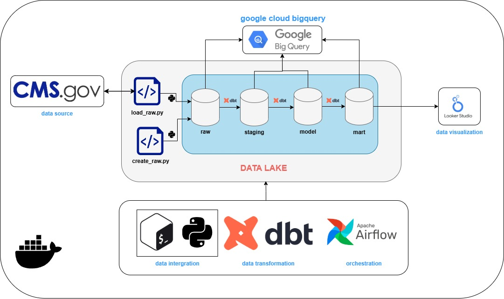

# CMS-Beneficiary2024-pipeline

## Deskripsi
Proyek ini membangun end-to-end data pipeline untuk mengolah dataset Medicare [Beneficiary 2024](https://github.com/sdg-1/healthcare-claims-analytics-project) dari CMS (Centers for Medicare & Medicaid Services).Pipeline ini memproses data mulai dari Extract → Load → Transform (ELT) dari file CSV ke Google BigQuery, dengan DBT untuk transformasi & pemodelan data,serta Apache Airflow untuk orkestrasi. Hasil akhirnya adalah Data Mart yang siap digunakan untuk analisis, termasuk metrik bulanan, demografi peserta, status kepesertaan, dan indikator cakupan.

## End-to-End Data Architecture

Arsitektur sistem menggunakan:
- *Data Source*: Dataset Beneficiary dari [CMS.gov](https://data.cms.gov/collection/synthetic-medicare-enrollment-fee-for-service-claims-and-prescription-drug-event).
- *Data Integration*: Script Python untuk memuat data ke Google BigQuery pada layer `raw`.
- *Data Transformation*: DBT digunakan untuk membuat tabel `staging`, `model`, dan `data mart`.
- *Data Orchestration*: Apache Airflow mengatur urutan eksekusi job.
- *Visualization*: Looker Studio digunakan untuk membuat dashboard interaktif.
Flow:
`cms.gov → RAW → STAGING → MODEL → MART → Looker Studio`

## Data Model (Star Chema)

Struktur Star Schema pada Data Warehouse:
- *Fact Table*: `fact_beneficiary_month` menyimpan metrik bulanan seperti status Medicare, buy-in, dual status, dan coverage months.
- *Dimension Tables*:
    - `dim_location`: Informasi lokasi (county, state, ZIP).
    - `dim_plan`: Informasi plan/kontrak beneficiary.
    - `dim_profile`: Profil demografis beneficiary.
    - `dim_enrollment`: Informasi pendaftaran dan sumber enrollment.
    - `dim_entitlemen`t: Alasan entitlement, ESRD indicator, termination code.

## Airflow Workflow Diagram

Diagram ini menunjukkan alur eksekusi pipeline `Apache Airflow`:
- *START → Download → Create Dataset → Load RAW* menggunakan Python.
- Setelah data raw di-load, task akan melakukan delay lalu trigger DBT workflow.
- DBT menjalankan proses *Staging → Modeling → Validasi → Data Mart*.
- Pemisahan alur Airflow dan DBT membantu memisahkan proses orchestration dan *data transformation*.

## Dashboard

Visualisasi dashboard menunjukkan distribusi data beneficiary:
- *Bar Chart*: Distribusi jumlah beneficiary berdasarkan kelompok umur dan gender.
- *Donut Chart*: Perbandingan gender.
- *KPI Card*: Menampilkan total beneficiary.

